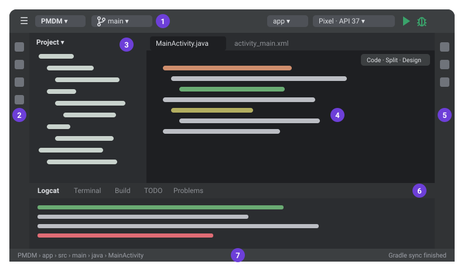

# PMDM · Curso 2026-27

**Programación Multimedia y Dispositivos Móviles · 2º DAM**

Este repositorio es el proyecto Android de todo el módulo. Cada **rama** es un
tema, con sus apuntes en HTML y las explicaciones en los comentarios `TODO` del
código. Esta rama, `main`, es la base del proyecto.

## 1. Clonar el proyecto

Solo se hace una vez, al principio del curso:

1. Copia la dirección de este repositorio: botón verde **Code** de esta página → pestaña *HTTPS*.
2. En la pantalla de bienvenida de Android Studio pulsa **Clone Repository**
   (con un proyecto abierto: *File → New → Project from Version Control*),
   pega la dirección y elige una carpeta.
3. Espera a que termine la sincronización de Gradle. Si te pide instalar una
   plataforma del SDK, acepta.

## 2. Abrir los apuntes

Los apuntes están en la carpeta `recursos/html/` del proyecto y se abren **en el
navegador desde tu copia local**. En GitHub solo verías su código.

- **En Android Studio:** botón derecho sobre el fichero → *Open In → Browser*.
- **En el explorador de Windows:** doble clic sobre el fichero.

## 3. Índice

| Apuntes | Fichero | Contenido |
|---|---|---|
| 📌 **Cómo usar este repositorio** | [`recursos/html/como_usar.html`](recursos/html/como_usar.html) | Traer cada tema nuevo, estudiar una rama y normas para no tener conflictos con Git. |
| 🧭 **Guía de Android Studio** | [`recursos/html/guia_android_studio.html`](recursos/html/guia_android_studio.html) | Partes del entorno, estructura del proyecto, ficheros clave, Gradle, ejecutar, Logcat, depurador y ciclo de vida. |
| 📘 **UD1 · Introducción a Android** | [`recursos/html/UD01_Introduccion_Android.html`](recursos/html/UD01_Introduccion_Android.html) | Dispositivos móviles, tecnologías, arquitectura de Android, primer proyecto, despliegue y ciclo de vida. |

Estos tres apuntes están en todas las ramas. Cada rama añade los suyos, que
encontrarás en el `README.md` de esa rama.

## 4. Versiones del proyecto

| | |
|---|---|
| Lenguaje | Java, con diseño de pantallas en XML |
| Android mínimo (`minSdk`) | 28 (Android 9) |
| Compilación (`compileSdk`) | 37 (Android 17) |
| Comportamiento (`targetSdk`) | 36 (Android 16) |
| Gradle / plugin de Android | 9.6 / 9.4 |

No hace falta instalar nada aparte de Android Studio: Gradle y el SDK necesario
se descargan solos al abrir el proyecto.
